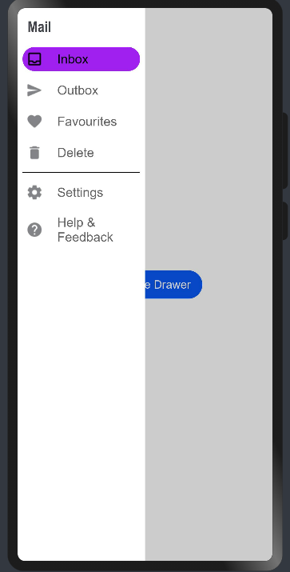

# Material Select

This library provides a navigation drawer in material design implemented using extended typescript

## Download & Install

Install using npm

```npm i @ohos/navigation-drawer```

## Usage Instructions

1. Import files and code dependencies

```ets
import { MenuOption, DrawerSize } from '@ohos/material-select'

import { Drawer } from '@ohos/material-select'
```

2. Initialize drawer model data

```
private model:Drawer.Model = new Drawer.Model()

private menuModel: Drawer.MenuModel = new Drawer.MenuModel()
```

4. Initialize menus for drawer component

```
private menu: MenuOption[] = [
  new MenuOption('1', "Inbox", 'pages/index', $r('app.media.inbox')),
  new MenuOption('2', "Outbox", 'pages/index', $r('app.media.send')),
  new MenuOption('3', "Favourites", 'pages/index', $r('app.media.favorite')),
  new MenuOption('4', "Delete", 'pages/index', $r('app.media.delete')),
]

private extraOptions: MenuOption[] = [
  new MenuOption('6', "Settings", 'pages/index', $r('app.media.settings')),
  new MenuOption('7', "Help & Feedback", 'pages/index', $r('app.media.help'))
]
```

5. Create @State variable that will control the visibility of drawer

```
@State visible: boolean = false
```

5. Code for creating component with drawer

```
build() {
  // A stack will be used to hide/display the drawer
  Stack() {
    // User made UI is first shown
    Column() {
      Button('Open side Drawer').onClick(() => {
        // Time duration for navigation grow animation is set by user
        animateTo({ duration: 500 }, () => {
          this.vis = !this.vis
        })
      })
    }

    // Drawer will be called next
    Drawer({
      selected: '1',
      visible: $vis,  // Pass reference to variable to control drawer visibility
      model: this.model,
      menuModel: this.menuModel,
    })
  }
  // Keep stack to cover fullscreen
  .width('100%')
  .height('100%')
}
```



## Compatibility

Supports OpenHarmony API version 9

## Code Contribution

If you find any problems during usage, you can submit an [Issue](https://github.com/Applib-OpenHarmony/Material_UI_Select/issues) to us. Of course, we also welcome you to send us [PR](https://github.com/Applib-OpenHarmony/Material_UI_Select/pulls).

## Open source License

This project is based
on [Apache License 2.0](https://github.com/Applib-OpenHarmony/Material_UI_Select/blob/main/LICENSE), please enjoy and
participate in open source freely.

## Open Issues


# Reference:

Design by : Sarthak Gothalyan